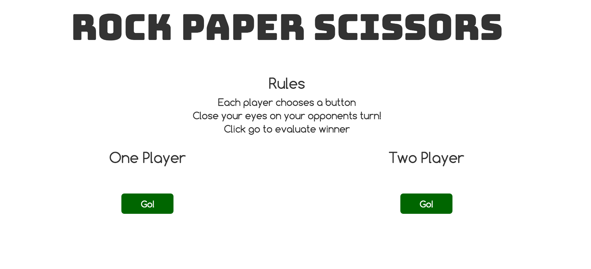

# Rock Paper Scissors

#### _A game to practice PHP tests, September 14, 2016_

#### By _**Mark Lawson & Aimen Khakwani**_

## Description

This website is a game of Rock Paper Scissors. It has a one player option as well as two player. Players choose an option and play! The game will calculate the winner.

## Setup/Installation Requirements

* Clone the repository
* Using the command line, navigate to the project's root directory
* Install dependencies by running $ composer install
* Navigate to the /web directory and start a local server with $ php -S localhost:8000
* Open a browser and go to the address http://localhost:8000 to view the application

## Specifications

* If Player 1 chooses Rock & Player 2 chooses Scissors, Player 1 wins
    * Example input: Rock & Scissors
    * Example output: Player 1

* If Player 1 chooses Paper & Player 2 chooses Rock, Player 1 wins
    * Example input: Paper & Rock
    * Example output: Player 1

* If Player 1 chooses Scissors & Player 2 chooses Paper, Player 1 wins
    * Example input: Scissors & Paper
    * Example output: Player 1

* If Player 1 chooses Scissors & Player 2 chooses Rock, Player 2 wins
    * Example input: Scissors & Rock
    * Example output: Player 2

* If Player 1 chooses Rock & Player 2 chooses Paper, Player 2 wins
    * Example input: Rock & Paper
    * Example output: Player 2

* If Player 1 chooses Paper & Player 2 chooses Scissors, Player 2 wins
    * Example input: Paper & Scissors
    * Example output: Player 2

* If both players choose the same option, it's a draw.
    * Example input: Paper & Paper
    * Example output: Draw

## Known Bugs

There are no known bugs at this time.

## Support and Contact Details

For questions or comments, please contact _mlawson3691@gmail.com_.

## Technologies Used

* _PHP_
* _Silex_
* _Twig_
* _Bootstrap_

### License

*This website is licensed under the MIT license.*  
Copyright (c) 2016 **_Mark Lawson & Aimen Khakwani_**
